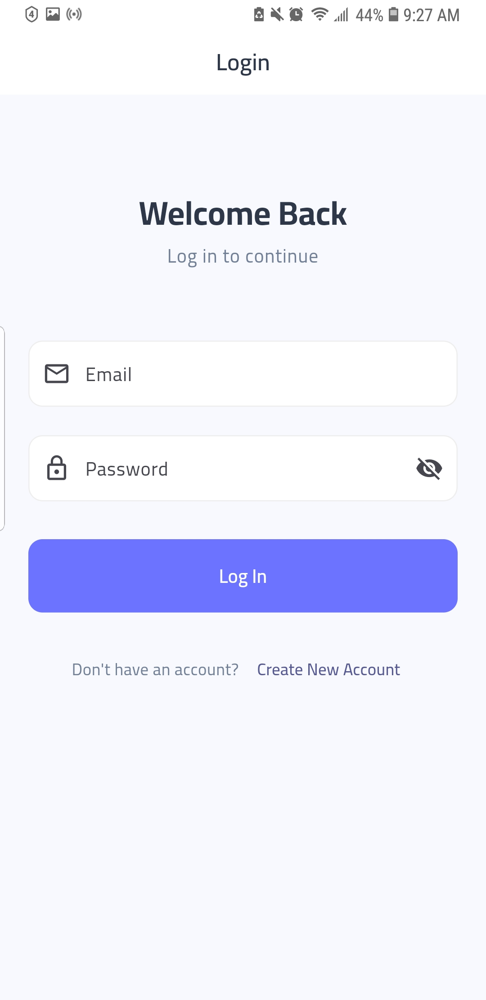

# Wise Quotes Email Sender App 📩✨

## Introduction
A unique and beautifully designed app that delivers inspiring wise quotes to users via email efficiently and reliably.  
Leveraging modern technologies like **Resend** and **Convex** for seamless and fast email delivery, this app lets users receive daily emails, express their current mood, and get personalized quotes from their favorite characters.

---

## Key Features 🚀

- **Automatic daily email delivery** of inspiring quotes.
- **Mood-based quote selection**: Users can share their current mood and receive quotes tailored from a matching character.
- **Personalized daily quotes** based on the user’s favorite character.
- **Responsive and elegant design** with soothing colors for a pleasant user experience.
- **Highly optimized performance** powered by:
  - The **http** package for efficient API communication.
  - **Convex** as a backend database and service.
  - **Shared Preferences** for caching and faster data retrieval.
- Lightweight and easy to use.

---

## Technologies Used 🛠️

- **Flutter** for a smooth and responsive UI.
- **Resend API** for reliable email sending.
- **Convex** backend for data storage and business logic.
- **http** package for API calls.
- **Shared Preferences** for improving app performance and user experience.

---

## How to Use 📲

1. Run the app on your device.
2. Select your current mood from the mood list.
3. Receive an inspiring quote from a character that matches your mood.
4. Enable daily emails to get motivational quotes sent automatically.
5. Enjoy the beautiful and seamless design experience.

---

## Why This App? 💡

In today’s fast-paced world filled with stress, everyone needs a daily boost of inspiration.  
This app serves as your daily companion by delivering wise and motivational quotes personalized to your feelings, helping you stay positive and energized throughout your day.

---

## App Preview 📸
## App Preview 📸

  
  
  
  
  

---

## Contact Us 📬

Have questions or suggestions?  
Feel free to reach out at: [alhakmimaad@email.com]

---

# Thank you for your interest! 🙌
